# Cirno Ball / 琪露诺弹球

基于cocos2d-x 3.12版本的打砖块游戏。

A simple block breaking game based on cocos2d-x.

Teammate注意：clone时请添加递归参数。
`git clone --recursive git@github.com:yifanc62/CirnoBall.git`

## 主菜单
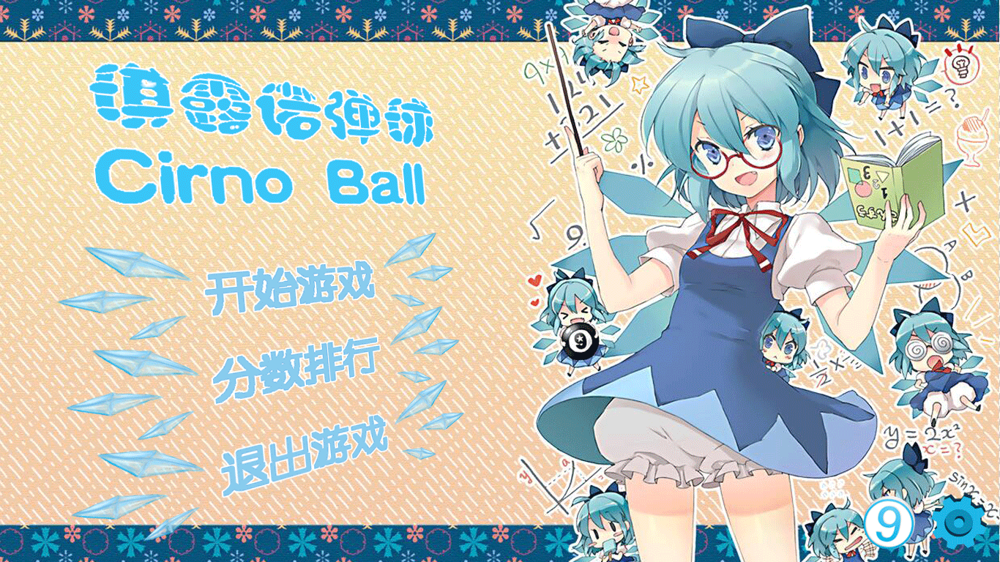

## 其他页面
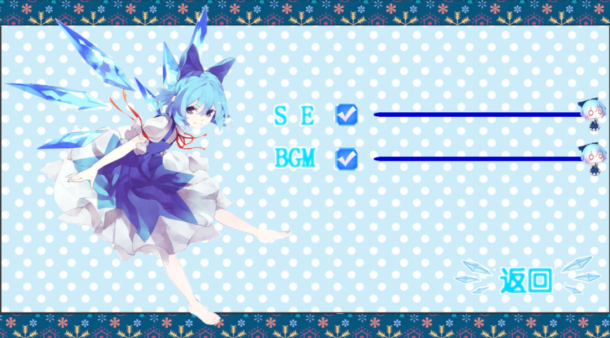
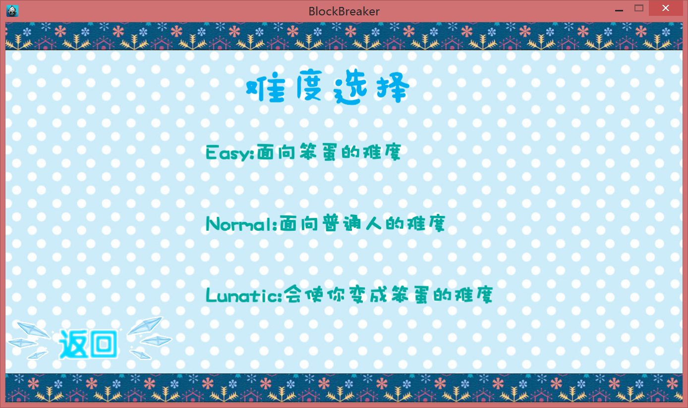
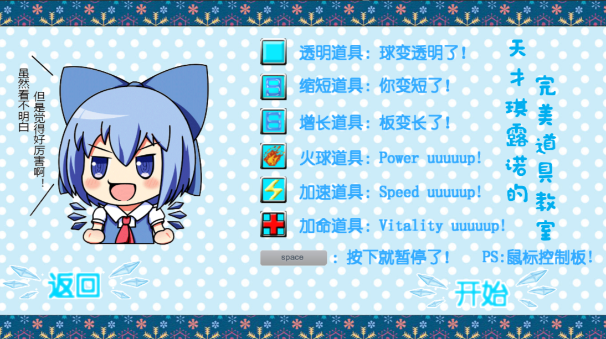
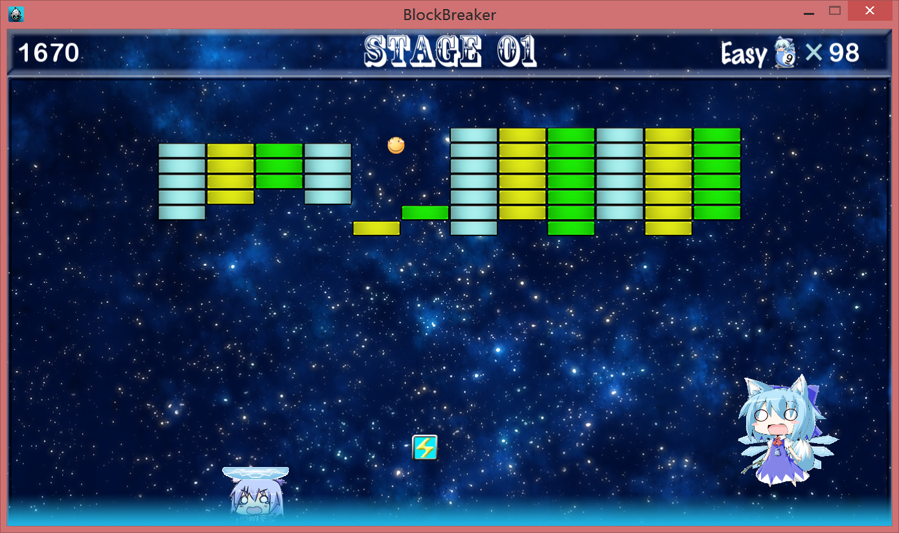
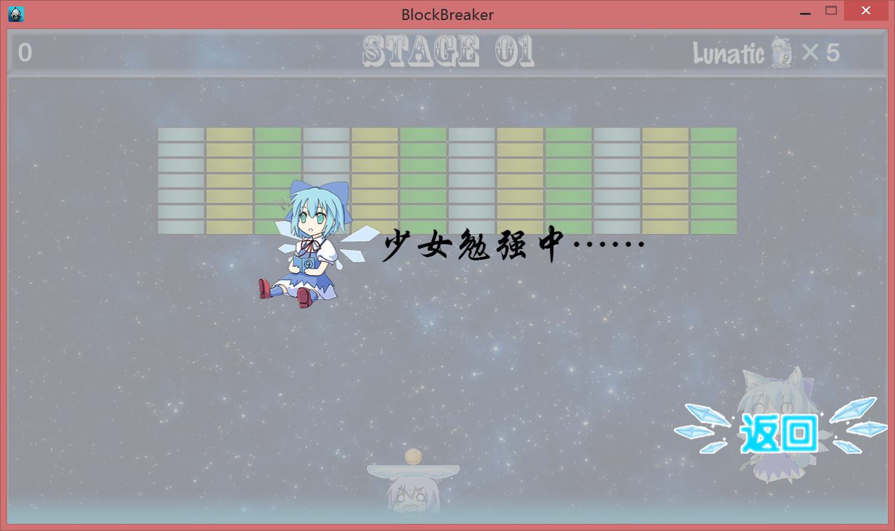
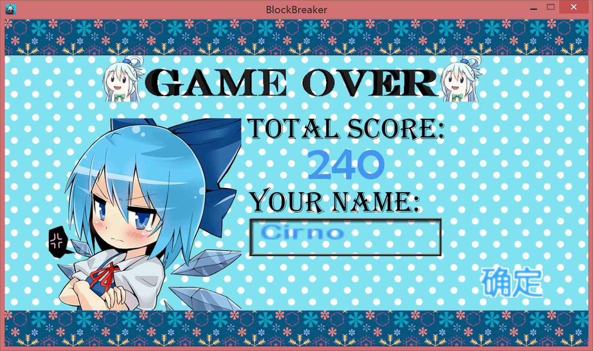
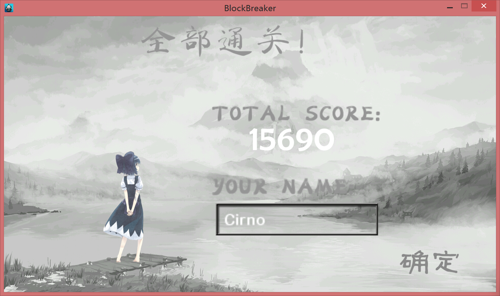
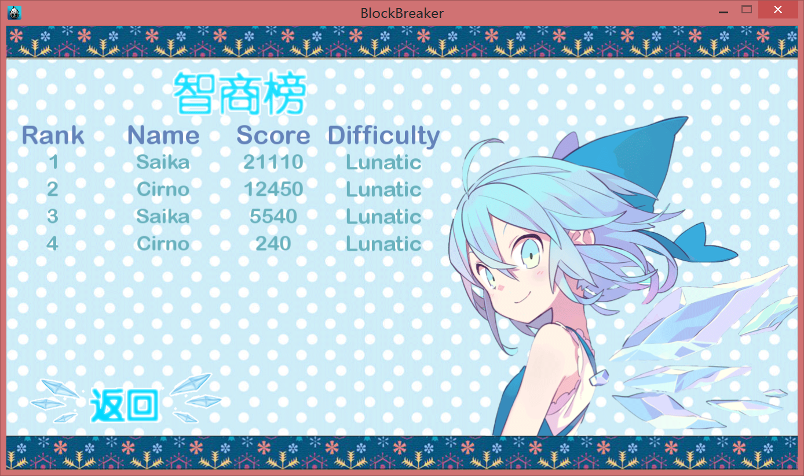

## 游戏关卡
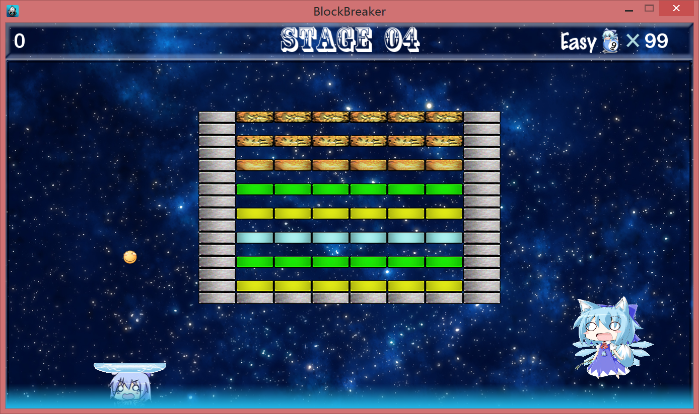
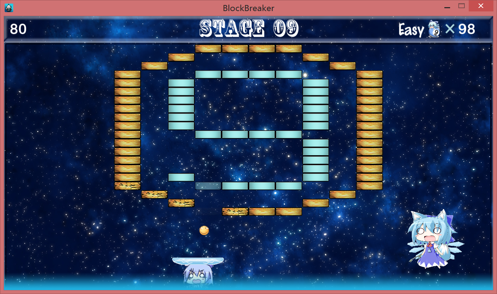
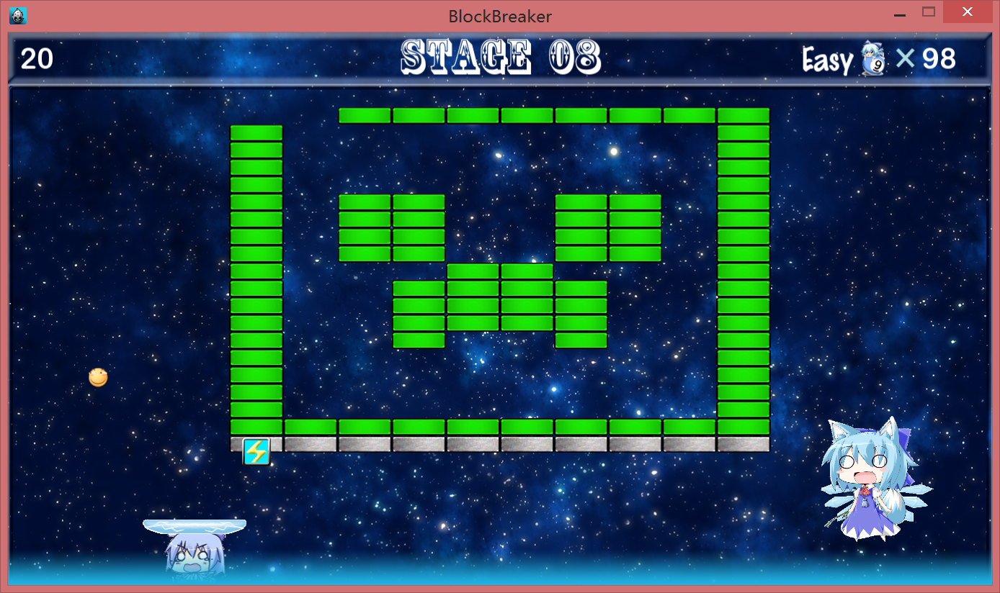
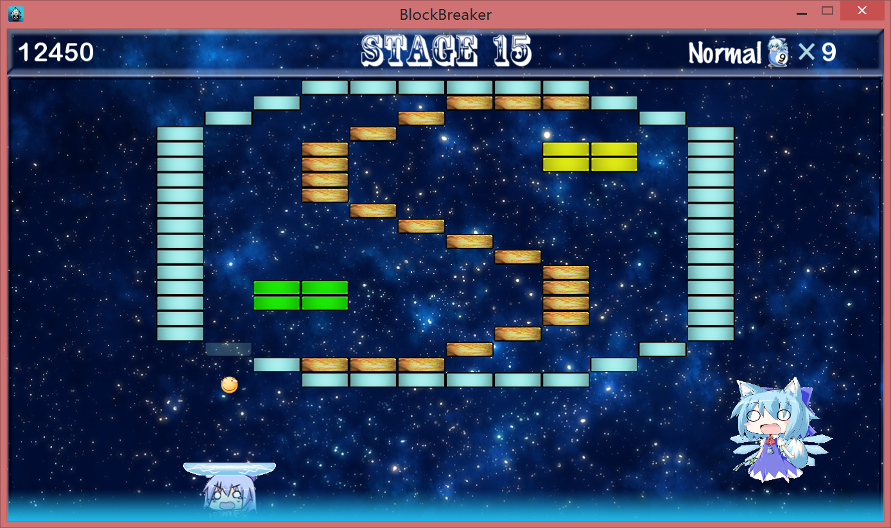

## 关于Cirno Team
http://cirnoteam.varkarix.com/
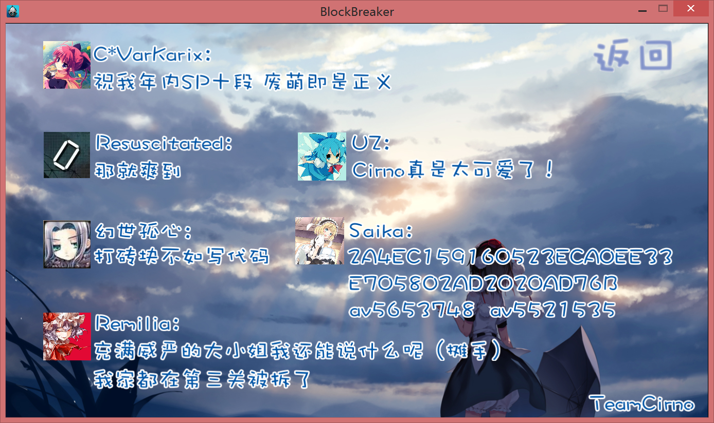